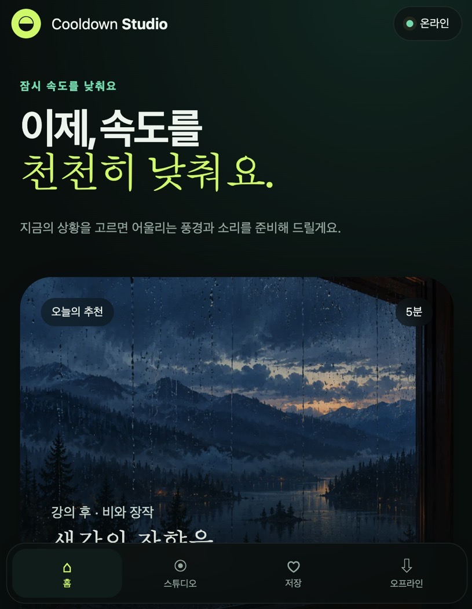
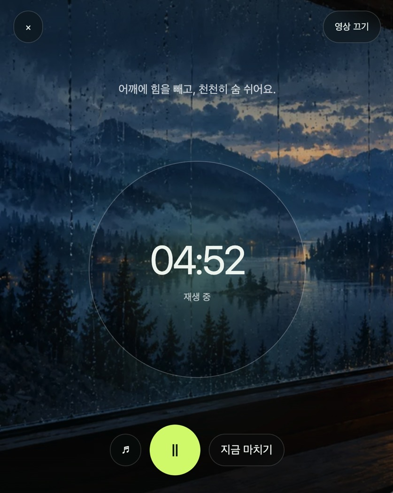
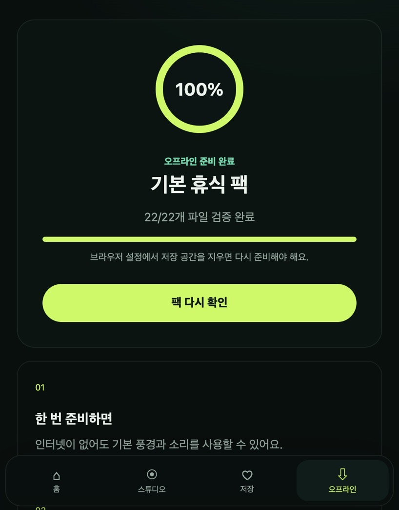

<p align="center">
  
  
  
</p>

# 쿨다운 스튜디오

강의·업무가 끝난 뒤 5–20분 동안 좋아하는 풍경과 자연음을 조합하고, 호흡을 가다듬으며 쉬는 모바일 우선 오프라인 PWA입니다. 별도의 계정이나 서버 없이 브라우저 안에서 동작하며, 미리 콘텐츠 팩을 준비하면 인터넷이 없는 환경에서도 사용할 수 있습니다.

## 이번 작업의 주요 내용

### 휴식 시작 흐름

- `강의 후`, `업무 후`, `잠들기 전` 세 가지 상황별 기본 프리셋 제공
- 홈 화면에서 추천 조합으로 5분 세션을 바로 시작
- 풍경 6종과 자연음 6종을 조합하는 스튜디오 화면 구현
- 최대 3개 오디오를 동시에 선택하고 트랙별 음량과 전체 음량 조절

### 세션 플레이어

- 5·10·20분 타이머와 정확한 남은 시간 표시
- 재생·일시정지·재개·음소거·즉시 종료 지원
- 종료 10초 전부터 전체 음량을 부드럽게 낮추는 페이드아웃
- 모션 줄이기 설정 또는 영상 재생 실패 시 정지 풍경으로 자동 전환
- MP4와 WebM 이중 포맷으로 주요 브라우저의 영상 코덱 차이에 대응

### 저장과 오프라인

- 풍경·소리·개별 음량·시간을 프리셋으로 저장, 불러오기, 삭제
- `localStorage`를 사용해 다음 방문에도 최근 설정과 저장한 풍경 복원
- Service Worker로 앱 셸을 캐시하고, 사용자가 요청할 때 콘텐츠 팩 다운로드
- 파일별 크기와 SHA-256을 검증한 뒤에만 `오프라인 준비 완료` 표시
- 현재 기본 팩: 이미지 6개, MP3 6개, H.264 MP4 5개, WebM 5개 — 총 22개 파일, 약 14.4MB

### UI와 접근성

- 모바일과 데스크톱에 맞춰 변하는 반응형 레이아웃
- 명확한 키보드 포커스와 최소 44px 터치 영역
- 현재 선택, 재생 상태, 다운로드 진행률을 텍스트로 함께 제공
- `prefers-reduced-motion` 환경에서 불필요한 움직임 제한
- 외부 폰트나 CDN 없이 모든 핵심 화면과 자산을 프로젝트 안에 포함

## 주요 오류 수정

### 영상이 일부 브라우저에서 재생되지 않던 문제

H.264 지원 여부가 브라우저 환경마다 달라 세션 영상이 정지 이미지로만 표시될 수 있었습니다. H.264 MP4와 VP9 WebM을 함께 제공하고, 브라우저가 재생 가능한 형식을 선택하도록 수정했습니다.

또한 Service Worker가 영상 요청을 가로챌 때 Range 요청 처리 차이로 재생이 실패할 수 있어, 짧은 영상을 완전히 받은 뒤 Blob URL로 재생하고 세션 종료 시 URL을 해제하도록 변경했습니다.

### 화면 하단 메뉴 전환이 갱신되지 않던 문제

이전 앱 셸이 Service Worker 캐시에 남아 최신 내비게이션 코드가 즉시 반영되지 않는 상황을 확인했습니다. 캐시 버전을 갱신하고 하단 메뉴의 화면 전환 연결을 명시적으로 구성해 홈·스튜디오·저장·오프라인 화면이 안정적으로 전환되도록 했습니다.

### 오디오 제작 및 인코딩 문제

운영체제 기본 변환 도구에서 MP3 인코딩이 실패하는 환경을 고려해, 프로젝트 스크립트가 직접 60초 길이의 자연음 텍스처를 생성하고 MP3로 인코딩하도록 정리했습니다. 각 소리는 반복 지점에서 갑작스러운 클릭이 나지 않도록 시작과 끝을 교차 혼합합니다.

### 오프라인 준비 상태의 신뢰성

단순히 `navigator.onLine` 값만 확인하던 방식 대신 실제 캐시 파일 수, 바이트 크기, SHA-256을 검증합니다. 검증 도중 실패하면 완료 상태로 바꾸지 않고 해당 파일부터 다시 시도할 수 있습니다. 실제 브라우저 테스트에서 22/22개 파일 검증과 세션 재생을 확인했습니다.

## 실행

Service Worker와 Cache API 확인을 위해 `file://`로 직접 열지 말고 로컬 서버를 사용합니다.

```bash
npm install
npm run serve
```

브라우저에서 `http://localhost:4173`을 열고 **오프라인 → 오프라인 팩 준비**를 누릅니다. `오프라인 준비 완료`가 표시되면 개발자 도구에서 네트워크를 Offline으로 전환한 뒤 페이지를 다시 열어 확인할 수 있습니다.

다른 포트를 사용하려면 다음처럼 실행할 수 있습니다.

```bash
python3 -m http.server 4176
```

## 자산 갱신

```bash
npm run assets:audio
npm run assets:video
npm run assets:manifest
npm run check
```

- `assets/licenses.csv`: 이미지·오디오·영상의 제작 및 이용 기록
- `assets/manifest.json`: 실제 파일 크기와 SHA-256을 포함한 오프라인 팩 목록
- `scripts/generate-ambience.mjs`: 자연음 MP3 생성
- `scripts/encode-videos.mjs`: MP4·WebM 루프 영상 생성
- `scripts/build-asset-manifest.mjs`: 오프라인 팩 manifest 갱신

운영 자산을 교체하면 `assets/licenses.csv`를 갱신한 뒤 `npm run assets:manifest`와 `npm run check`를 실행하세요.
